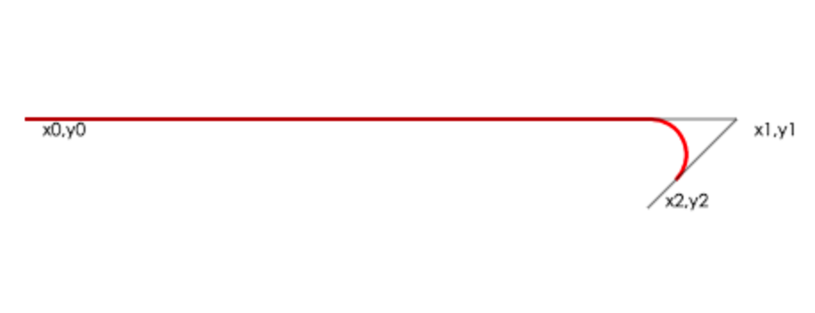

# 使用 arcTo 绘制圆角矩形

原因：由于 Canvas 没有绘制圆角矩形的方法，所以需要自己绘制。在参考众多绘制方案后，觉得最简单的实现方法就是利用 arcTo 来绘制。

arcTo(x1, y1, x2, y2, radius) 的文档可参考 [MDN](https://developer.mozilla.org/en-US/docs/Web/API/CanvasRenderingContext2D/arcTo)。其原理是：在当前点(x0, y0)与第一个控制点(x1, y1)的连线，第一个控制点(x1, y1)与第二个控制点(x2, y2)的连线间，画出半径为 radius 的圆弧。



根据本人实践发现，有2点值得注意的：
1. 当前点与第一控制点重叠时，是无法画出圆弧的
2. 当前点与第一控制点的差值大于圆半径时，会有多余的线段

所以我得出的最佳实践是，当前点与第一控制点的差值等于半径。然后封装成函数，即：
``` javascript
function fillRoundRect(ctx, x, y, width, height, radius) {
    ctx.beginPath()
    ctx.moveTo(x, y)
    ctx.arcTo(x + width, y, x + width, y + height - radius, radius)
    ctx.arcTo(x + width, y + height, x + radius, y + height, radius)
    ctx.arcTo(x, y + height, x, y + radius, radius)
    ctx.arcTo(x, y, x + radius, y, radius)
    ctx.fill()
}
```